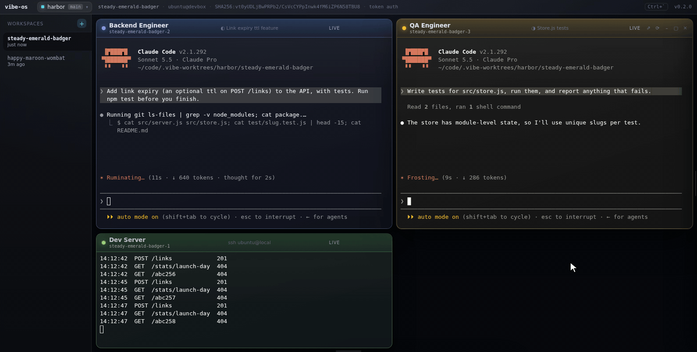

<div align="center">


# vibe-os

**A coding desktop in the browser, on a box you own.**

Switch between the git repos on a machine, spin up a worktree per piece of work,
and open terminals into it, from anything with a browser.

[](https://github.com/tsconfigdotjson/vibe-os/actions/workflows/ci.yml)
[](#license)

<br>



</div>

---

Open the desktop and you get a project picker, a sidebar of workspaces, and
windows you can drag around a snap grid. Every window is a
[dtach](https://github.com/crigler/dtach) session in its workspace's worktree,
so closing the tab and coming back tomorrow finds whatever was running still
running.

Down the right is a rail of **profiles**, the roles you work as. *QA Engineer*,
*Backend Manager*, whatever your work divides into. Each carries a colour, a
harness with its settings, and a standing prompt. Click one and you get a window
tinted in its colour with Claude already running in the worktree.

There is nothing to configure. No key to copy and paste, no `authorized_keys` to
edit, no `sshd_config` change, and no root.

## Contents

- [Quick start](#quick-start)
- [How it works](#how-it-works)
- [Documentation](#documentation)
- [Contributing](#contributing)
- [License](#license)

---

## Quick start

### Try it locally

```bash
docker run --rm -p 127.0.0.1:8080:80 -e VIBE_OS_NO_TOKEN=1 ghcr.io/tsconfigdotjson/vibe-os
open http://localhost:8080
```

A blank Debian box with sshd, dtach and git, the same shape as a fresh VPS. The
token is off, so the port is on loopback only: a vibe-os with no token is a
shell for anyone who can reach it. The image has no harness, so profiles open a
shell; from a clone, `docker compose up --build` adds Claude Code.

### Or set up a VPS

On a fresh Debian or Ubuntu box, as any user with sudo (or as root, which
creates one):

```bash
curl -fsSL https://raw.githubusercontent.com/tsconfigdotjson/vibe-os/main/install.sh | sh
vibe-os setup
```

`setup` runs the same checks as `doctor` and offers to fix each one, printing
every command before it runs it. See [Setup](docs/deploying.md#setup) for what it does.

For an agent with SSH access to the box, the prompt is one line:

> Install vibe-os with `curl -fsSL https://raw.githubusercontent.com/tsconfigdotjson/vibe-os/main/install.sh | sh`, then run `vibe-os setup --yes` and show me its output.

---

## How it works

```
┌─────────────────┐                        ┌──────────────────┐        ┌──────┐
│     browser     │   wss://…/websocket    │  vibe-os (bun)   │  TCP   │ sshd │
│   ssh.wasm      │ ─────────────────────► │    :80 / :443    │ ─────► │  :22 │
│  private key    │                        │   byte pipe      │        │      │
│  in IndexedDB   │   POST /api/ssh/…      │   + SSH CA       │        │dtach │
└─────────────────┘ ─────────────────────► └──────────────────┘        └───▲──┘
                                                                           │
┌─────────────────┐                                                        │
│  your terminal  │   ssh -t … vibe-os attach quiet-amber-otter-1           │
│   ssh + dtach   │ ──────────────────────────────────────────────────────►─┘
└─────────────────┘
```

**The SSH protocol runs inside the browser.** Key exchange, authentication and
channel multiplexing happen in a Go/WASM sandbox in the tab. The server is a
byte pipe: it never sees plaintext and holds no credentials for your session.

**vibe-os is its own short-lived certificate authority.** On first start it
generates an ed25519 CA and appends one `cert-authority` line to
`~/.ssh/authorized_keys`. Each window generates a keypair in the browser, keeps
the private half in IndexedDB, and posts only the public half to be signed.
Certificates last 12 hours. Revoking every browser that ever connected is
deleting one line.

**Windows survive because dtach owns them, not vibe-os.** Each certificate
carries a `force-command` that attaches to the window's dtach socket, creating
it in the workspace's worktree if it is not there yet. Restarting the server,
reloading the page and closing the laptop all leave the session running.

The bottom route in that diagram is the same session by a different door: your
own ssh client, your own key, straight to sshd. See
[popping out](docs/using.md#popping-a-terminal-out).

---

## Documentation

| | |
| --- | --- |
| [Using it](docs/using.md) | projects, workspaces, profiles, prompts, popping a terminal out, the desktop and its shortcuts |
| [Harnesses](docs/harnesses.md) | Hermes, Cursor and Codex, and adding your own |
| [Deploying on a VPS](docs/deploying.md) | what the box needs, setup, Tailscale, the firewall, memory, an always-on browser, updating |
| [Security](docs/security.md) | the token, what it gates, and what to put in front of it |
| [CLI reference](docs/cli.md) | every command and flag |
| [API](docs/api.md) | driving workspaces and windows over HTTP |
| [Development](docs/development.md) | building, testing and releasing |

**vibe-os hands out shell access to the machine it runs on.** Treat access to it
as equivalent to SSH access to the box, and read [Security](docs/security.md)
before exposing it anywhere.

---

## Contributing

Issues and pull requests welcome. Before opening one:

```bash
bun run check     # lint, typecheck and tests, the same three CI runs
```

Tests live in `test/` for the server and beside the code for the browser.
Anything with logic worth trusting should arrive with some.

[docs/gotchas.md](docs/gotchas.md) lists the traps in this codebase that cost
someone an afternoon. Worth a skim before changing the terminal or the session
plumbing.

Comments in this repository explain why rather than what. If you undo a
documented decision, update the reasoning with it.

---

## License

MIT, see [LICENSE](LICENSE). Bundles [c2FmZQ/sshterm](https://github.com/c2FmZQ/sshterm)
(MIT) and the packages listed in
[THIRD_PARTY_NOTICES.md](THIRD_PARTY_NOTICES.md). After changing dependencies,
regenerate that file with `bun run notices`.
